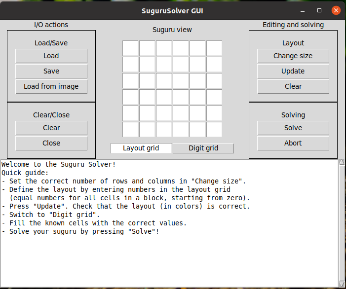
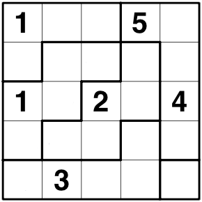
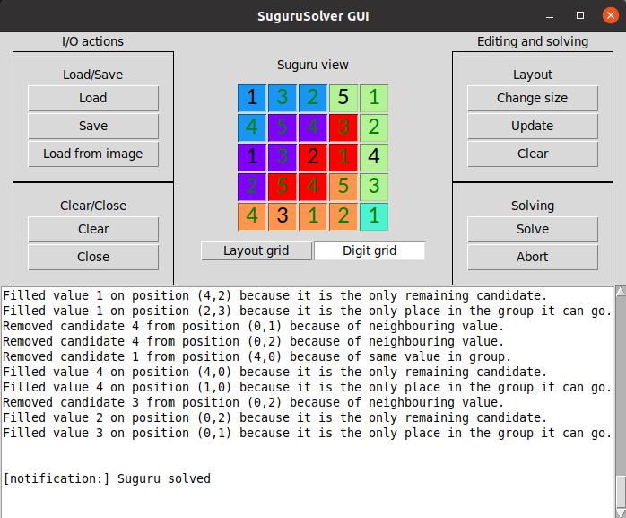
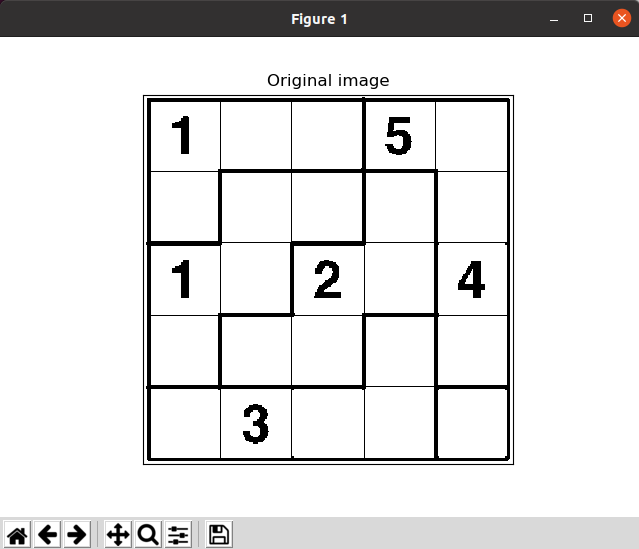
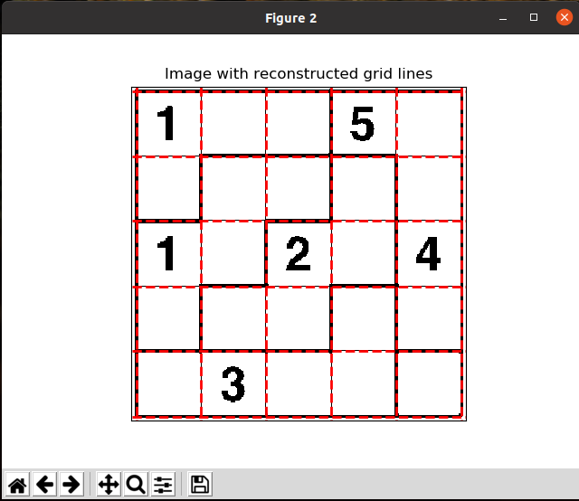
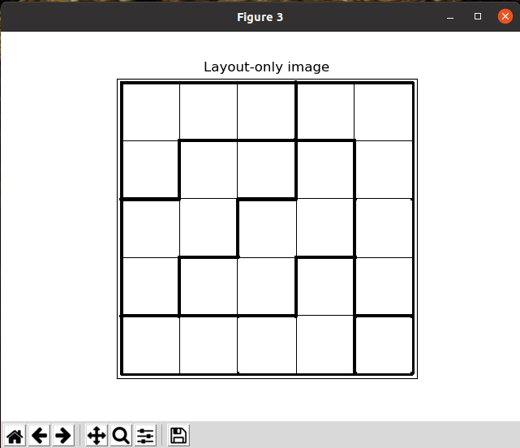
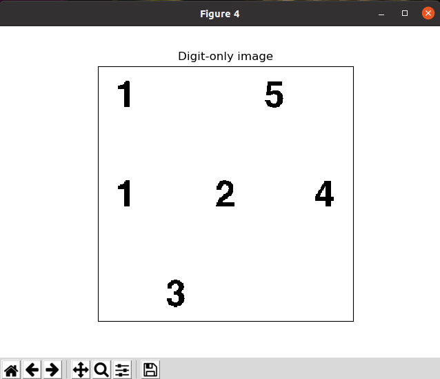
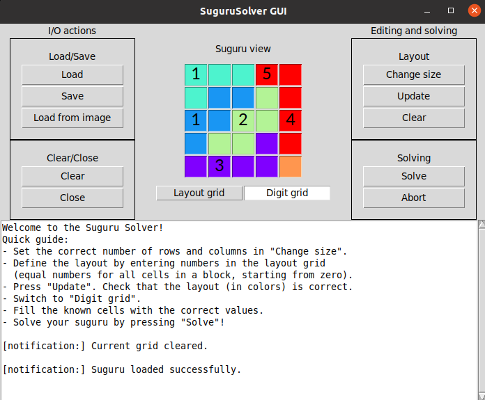

# SuguruSolver
Solver for suguru puzzles

## Quick manual
Start the program by navigating into the main project folder and running the command `python3 main.py`.  
The following window appears:  

First set the correct size of the grid by pressing the "Change size" button, filling in the correct numbers and pressing "Ok".
Then define the layout (i.e. the configuration of groups/blocks of cells) by filling in numbers in the cells according to the following rules:
   * Start from the number zero. Choose a group and fill all cells belonging to it with the number zero.
   * Choose another group and fill all cells belonging to it with the number one.
   * Repeat until all cells are filled.  

Then press the "Update" button. The layout appears as colours in the grid.  
Next, switch to the "Digit grid" instead of "Layout grid", and put the known initial numbers at the correct place in the grid.  

For example, suppose we have the following input suguru:  

This should be entered as follows in the SuguruSolver:  

Then, press "Solve". If the solver was succesful, the following output appears:  

## Loading a suguru from an image
It is possible to skip all manual entries and auto-reconstruct the input suguru directly from an image.
This will however only work under some limiting assumptions, such as clean and perfectly aligned images (no pictures).
Also the automatic digit recognition is known to be sub-optimal and will often need manual corrections.  

For the example suguru above, the automatic reading gives the following output:  

  

  

Ultimately resulting in the (correct) input suguru:  
  

## How to download?
Just to a regular clone from github, i.e. `git clone https://github.com/LukaLambrecht/SuguruSolver.git`

## Dependencies
The program runs on Python3. Additional required packages:
   * numpy
   * random
   * matplotlib
   * tkinter
   * opencv
   * sklearn
